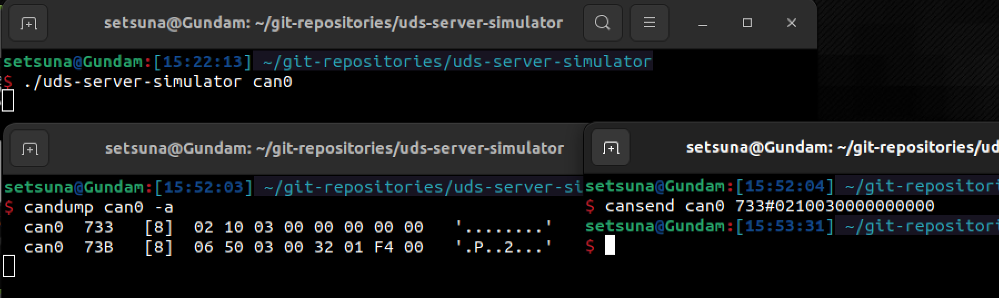

# uds-server-simulator
A configurable CAN UDS simulator.

Author: Honinbon

## Intro
This project is used to simulate the UDS server in the ECU, and can be configured into different ECU information through configuration files. This project welcomes all security researchers, security testers and bros who want to learn about ISO-14229.

## Preparation
If you have only a ubuntu without a can-hardware, you need to enable a virtual can interface.
```sh
sudo ip link add dev can0 type vcan

sudo ip link set can0 up
```

## Build
Compile it with `make` after `git clone` the repository.

```sh
git clone https://github.com/Honinb0n/uds-server-simulator

cd ./uds-server-simulator

make
```

## Configration file
The file `config.json` defines every ECU's information which needs to be initialized.

The `CURRENT_ECU` defines which ECU the server should simulate.

And you can also add custom ECU information. The field requirements are as follows.

* **Mandatory**
    * `func_req_id`: can be set to "0x7DF", or an empty string.
    * `phy_req_id`: e.g. "0x703"
    * `phy_resp_id`: e.g. "0x7A3"    

* **Optional** 
    * format: {"DID": "DATA", ...}   
        * `DID_No_Security`: These DIDs can be read and written without authentication.
        * `DID_Security_03`: These DIDs can be read without authentication, but written with 2703 authentication.
        * `DID_Security_19`: These DIDs can be read without authentication, but written with 2719 authentication.   
    * format: [DID1, DID2, ...] 
        * `DID_IO_Control`: The IO operation corresponding to the DID must be controlled with 27 authentication.

Examples:
```json
"GW": {
        "func_req_id": "",
        "phy_req_id": "0x703",
        "phy_resp_id": "0x7A3",
        "DID_No_Security": {
            "0xF18B": "2023.06.23"
        },
        "DID_Security_03": {
            "0xF180": "boot v1.0.1", 
            "0xF187": "GW v1.1.1"
        },
        "DID_Security_19": {
            "0xF190": "LUAU2AUB3GE383467",
            "0xF197": "GW"
        },
        "DID_IO_Control": []
    }
```

## Usage
1. Run the uds-server-simulator, and it will initialize information from `config.json`. If you don't use the parameter `-e`, the program will use the default `CURRENT_ECU`'s value defined in `config.json`.

    ```
    Usage:   
        uds-server-simulator [options] <CAN interface> 

    Options:  
        -e <ecu name>	ecu name: GW TBOX IVI HUT PKE ESP TPMS   
        -h              print this help menu  

    Examples:   
        ./uds-server-simulator -e TBOX can0  
    ```

2. You can use `cansend` and `candump` from [can-utils](https://github.com/linux-can/can-utils) to send and monitor can bus data.   

     
    
    Of course, you can use other socket can tool to send, receive, and even scan diagnostic can data by using [CANDetective](https://github.com/Honinb0n/CANDetective.git).

    Have a happy UDS hacking!

## Acknowledgments
The software refers to some excellent open source projects.

Thanks to:

* Craig Smith - uds-server: <https://github.com/zombieCraig/uds-server>

## License
GNU General Public License v2.0


